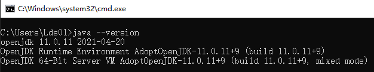
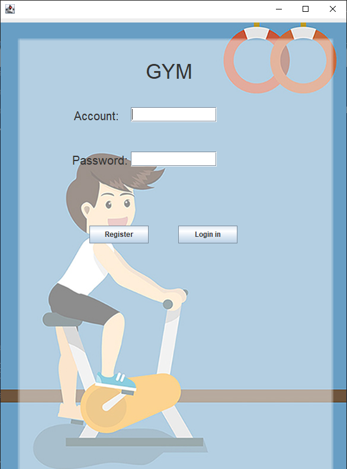

# Introduction
“London Fitness” is a small gym operating in London. Our Online Gym Program is designed 
to be a stand alone application and doesn't require connection to Internet during running time.

## Requirements
- Windows 10
- [openJDK 11.0.11](https://github.com/AdoptOpenJDK/openjdk11-binaries/releases/download/jdk-11.0.11+9/OpenJDK11U-jdk_x64_windows_hotspot_11.0.11_9.msi)
([Configure Environment Variables](https://confluence.atlassian.com/doc/setting-the-java_home-variable-in-windows-8895.html))
- junit-platform-console-standalone-1.7.1.jar (Already In `Requirements` Directory)

### Check Environment
- Open the cmd command line (Press `Win + R`, and input cmd, then press Enter) 
- Enter the location of the file (By using command `cd` )
- Enter `java --version` in the command line to check environment

## Compile
- Open the cmd command line (Press `Win + R`, and input cmd, then press Enter) 
- Enter the location of the file (By using command `cd` )
- Enter `javac -cp Requirements/junit-platform-console-standalone-1.7.1.jar *.java` in the command line

## Run
- Enter `java Login` in the command line to run the code

- After Register and Login in, you enter Main Menu

- Enter `java -jar junit-platform-console-standalone-1.7.1.jar -cp . -c {file}Test` to run TDD, where
`{file}` is one of `Account/Email/Member/Password/Trainer/Video`