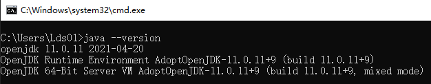

# Introduction
"London Fitness" is a small gym operating in London. Our Online Gym Program is designed 
to be a stand alone application and doesn't require connection to Internet during running time.
We have registered two user accounts in advance to let you try our application.

If encountering errors when compiling TDD code, please refer to **Compile** Part for further indication.

## Requirements
- Windows 10
- [openJDK 11.0.11](https://github.com/AdoptOpenJDK/openjdk11-binaries/releases/download/jdk-11.0.11+9/OpenJDK11U-jdk_x64_windows_hotspot_11.0.11_9.msi)
([Configure Environment Variables](https://confluence.atlassian.com/doc/setting-the-java_home-variable-in-windows-8895.html))
- junit-platform-console-standalone-1.7.1.jar (Already In `Requirements` Directory)

### Check Environment
- Open the cmd command line (Press `Win + R`, and input `cmd`, then press Enter) 
- Enter `Software` directory (By using command `cd` )
- Enter `java --version` in the command line to check environment

## Compile
- Open the cmd command line (Press `Win + R`, and input `cmd`, then press Enter) 
- Enter `Software` directory (By using command `cd` )
- Enter `javac Login.java` in the command line to compile the application without JUnit
- **Get `{file}Test.java` from `Test` directory to `Software` directory**, and then enter 
`javac -cp Requirements/junit-platform-console-standalone-1.7.1.jar {file}Test.java` in the command line 
to compile TDD, where `{file}` is one of `Account/Email/Member/Password/Trainer/Video`

## Run
- Open the cmd command line (Press `Win + R`, and input `cmd`, then press Enter) 
- Enter `Software` directory (By using command `cd` )
- Enter `java Login` in the command line to start up the Online Gym application
- We have registered two user accounts in advance to let you try our application
- (1)Account: Davis; Password:123456a; User Type: Normal
- (2)Account: Lisey; Password:123456A; User Type: VIP

- After Login in, you enter Main Menu

- **Get `{file}Test.java` from `Test` directory to `Software` directory**, 
and then enter `java -jar junit-platform-console-standalone-1.7.1.jar -cp . -c {file}Test` 
to run TDD, where `{file}` is one of `Account/Email/Member/Password/Trainer/Video`